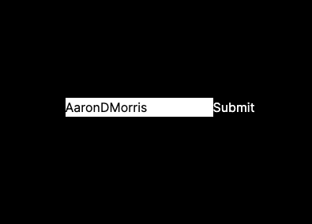
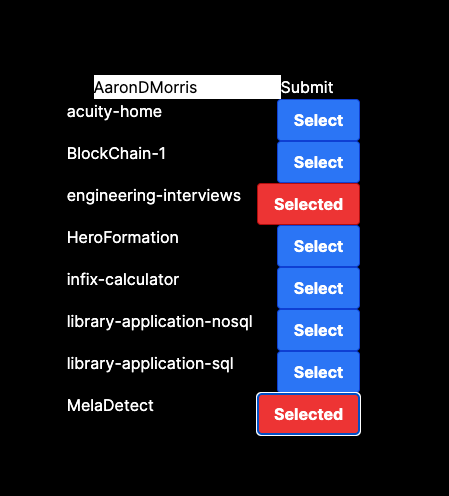

# Stateful Next.js Application Code Challenge

Welcome to the Stateful Next.js Application Code Challenge! This challenge is designed to assess your ability to use state in a Next.js application and interact with an API to retrieve and manipulate data.

**Please note: The emphasis of this challenge is on implementation rather than visual design. You are not expected to make the app look perfect.**

## Challenge Overview

The goal of this code challenge is to build a simple application using the template provided. The application should demonstrate the use of state to manage selected items and persist the state across page changes.

The challenge consists of the following tasks:

1. Set up the Next.js application using the provided template.
2. Create a component to fetch data from an API (e.g., GitHub API) and display a list of items.
3. Implement functionality to allow users to select/unselect items from the list.
4. Persist the selected items' state across page changes.

## Stretch Goals

While not required, you may attempt one or more of the following stretch goals to further enhance your application:

1. **Unit Tests:** Add unit tests to your application to ensure the functionality of various components and modules.
2. **Authentication:** Implement authentication into the application using GitHub OAuth integration or any other authentication method of your choice.

Please note that these stretch goals are not expected to be delivered unless you are applying for a senior role. However, we welcome all applicants to attempt one or more of them if they are interested and have the capacity to do so.

## Language and Libraries

- **Language:** It is expected that you use TypeScript rather than JavaScript for this challenge.
- **Libraries:** You are welcome to upgrade or install any new libraries you feel are necessary for the challenge. However, please justify your choices and explain why you decided to use a specific library.
- **State Management:** You may use any state management solution of your choice. However, the decision must be justified, explaining why you selected a particular state management solution.

## Time Limit

Please note that the expected completion time for this code challenge is approximately one hour. The intention is to assess your ability to implement the required functionality within a reasonable timeframe.

## Getting Started

To get started with the challenge, follow these steps:

1. Fork this repository on GitHub.
2. Clone the forked repository to your local machine.
3. Install the project dependencies by running `npm install` in the project root directory.
4. Start the development server using `npm run dev`.

## Requirements

To successfully complete this code challenge, make sure to fulfill the following requirements:

- Use Next.js as the framework for the application.
- Use state management to keep track of the selected items.
- Implement an API integration (e.g., GitHub API) to retrieve a list of items.
- Display the list of items and allow users to select/unselect them.
- Ensure that the selected items' state persists across page changes.

## Submission

Once you have completed the code challenge, create a new branch and push your changes to your forked repository. Then, open a pull request to the original repository.

## Resources

- [Next.js Documentation](https://nextjs.org/docs)
- [GitHub REST API](https://docs.github.com/en/rest)

## Example App Screenshots

## Tips

- Take your time to plan and understand the requirements before diving into coding.
- Break down the tasks into smaller, manageable steps.
- Write clean, readable, and well-documented code.
- Feel free to use any additional libraries or tools that you find helpful.

Good luck with the challenge! If you have any questions, feel free to reach out.
